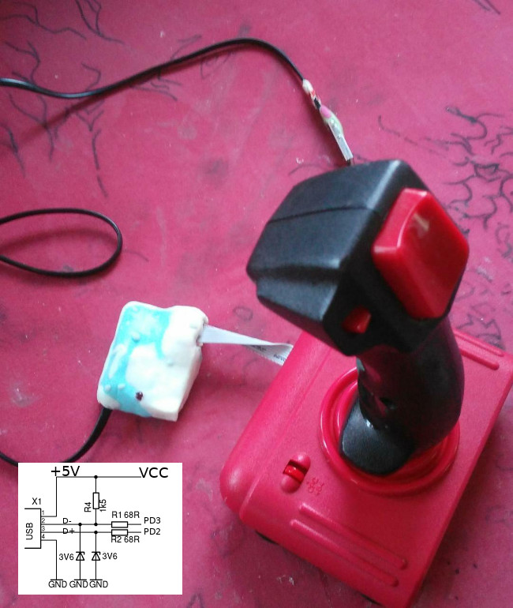

V-USB Joystick
==============
This uses V-USB to implement a USB joystick with minimal code. It supports up, down, left, right and three buttons (and can trivially handle 5 more). 

The code runs on 12MHz (external quarz) atmega8 chip. I use the usb 5V atmega power supply and
two 3.6V Z-Diodes vusb work around for D+ and D-

Building
--------
The makefile is for a usbASP programmer.

    make
    make flash
    make fuse

Hardware
--------
Pinout and Controls (connect to GND to press):

    USB D+           PD2   !!!
    USB D-           PD3   !!!
    Up                PC4
    Down              PC5
    Left              PC3
    Right             PC2
    Button 1         PC1
    Button 2         PC0
    Button 3         PD7  !!!
    5V+               VCC
    GND               GND
    Act LED+330 Ohm   PB0

Operation
---------
V-USB implements a low-speed USB device in software. When connected, it tells the host
that it's a USB joystick. It also tells the host what controls it has and the format of
the report it sends (usbHidReportDescriptor[] in main.c). Then when the joystick changes
it sends the new state of the controls to the host. This can only be done every 8ms (1/125
second), when the host asks the device if it has any updates. There are ways to make the
host check more often (up to 1000 times a second) by changing its hid polling rate.

Code Base
---------
by [Shay Green](https://github.com/gblargg/vusb-joystick) with LGPL
